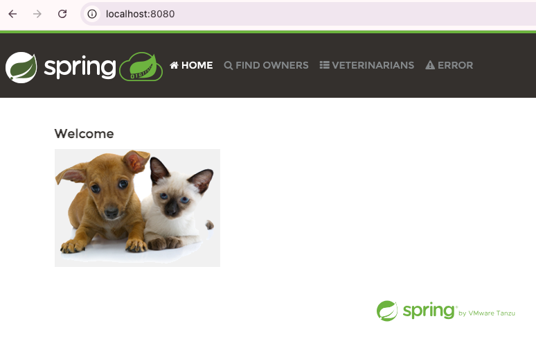
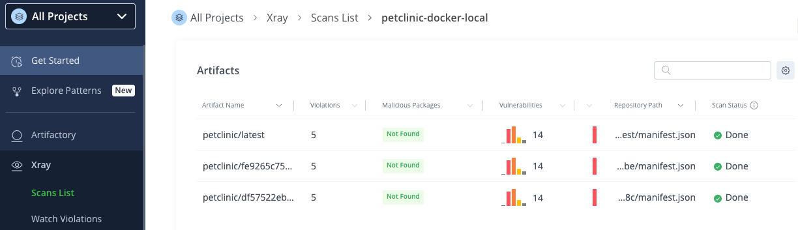

# Spring PetClinic CI/CD Pipeline (GitHub Actions, JFrog Artifactory + Xray)

This repository demonstrates a complete CI/CD pipeline for the Spring PetClinic project using **GitHub Actions** and **JFrog SaaS (Artifactory + Xray)**.

## Project Overview

- **Source Code**: Spring PetClinic (official Spring sample project)
- **Build Tool**: Maven Wrapper
- **Java Version**: 17
- **Containerization**: Docker
- **CI/CD**: GitHub Actions
- **Artifact Repository**: JFrog Artifactory (Docker)
- **Security Scanning**: JFrog Xray

## CI/CD Pipeline

The GitHub Actions workflow is defined in:
.github/workflows/jfrog-ci-maven.yml

### Pipeline Flow

The pipeline is triggered on every push to the `main` branch or manually via
`workflow_dispatch` and performs the following steps:

> Note: In the GitHub Actions workflow, the `DOCKER_REGISTRY` environment variable
> is populated from the `JF_DOCKER_REGISTRY` GitHub secret.

1. Check out source code from GitHub
2. Set up Java 17
3. (Optional) Cache Maven dependencies to improve build performance
4. Build and test the application using Maven Wrapper
   ```bash
   ./mvnw -B clean verify
   ```
5. Build a runnable Docker image
   ```bash
   docker build \
     -t $DOCKER_REGISTRY/$DOCKER_REPO/$IMAGE_NAME:${{ github.sha }} \
     -t $DOCKER_REGISTRY/$DOCKER_REPO/$IMAGE_NAME:latest \
     .
   ```
6. Authenticate to JFrog Artifactory using an Access Token
   ```bash
   echo "${{ secrets.JF_ACCESS_TOKEN }}" | docker login $DOCKER_REGISTRY \
     -u "${{ secrets.JF_USERNAME }}" --password-stdin
   ```
7. Push the Docker image to JFrog Artifactory
   ```bash
   docker push $DOCKER_REGISTRY/$DOCKER_REPO/$IMAGE_NAME:${{ github.sha }}
   docker push $DOCKER_REGISTRY/$DOCKER_REPO/$IMAGE_NAME:latest
   ```

This ensures the application is always built, tested, and published in a consistent
and automated manner.

## Docker Image

The Docker image is defined in the root-level `Dockerfile`.

### Dockerfile Summary

* Uses `eclipse-temurin:17-jre-alpine` as the base image
* Copies the built Spring Boot JAR file
* Exposes port `8080`
* Starts the application using:

  ```bash
  java -jar app.jar
  ```

The resulting image is lightweight and suitable for container-based execution.

## Maven Central Dependency Resolution

All project dependencies are resolved **exclusively from Maven Central**.

* No custom Maven mirrors are configured
* Default Maven settings are used
* This satisfies the requirement that dependencies must be resolved from Maven Central

## Required GitHub Secrets

The following secrets must be configured in the GitHub repository:

* `JF_USERNAME` – JFrog username
* `JF_ACCESS_TOKEN` – JFrog access token
* `JF_DOCKER_REGISTRY` – Docker registry host (e.g. `<company>.jfrog.io`)

These secrets are used by the GitHub Actions workflow to authenticate securely
with JFrog.

## Command to Obtain and Run the Docker Image

1. Export environment variables
```bash
export JF_DOCKER_REGISTRY=<your-company>.jfrog.io
export JF_USERNAME=<your-jfrog-username>
export JF_ACCESS_TOKEN=<your-jfrog-access-token>
```
2. Login using JFrog access token
```bash
echo $JF_ACCESS_TOKEN | docker login $JF_DOCKER_REGISTRY \
  -u $JF_USERNAME --password-stdin
```
3. Pull the latest Docker image
```bash
docker pull $JF_DOCKER_REGISTRY/petclinic-docker-local/petclinic:latest
```
4. Run the container
```bash
docker run --rm -p 8080:8080 \
$JF_DOCKER_REGISTRY/petclinic-docker-local/petclinic:latest
```

After starting the container, the application is accessible at:

```
http://localhost:8080
```


## JFrog Xray Scan Generation Process

### JFrog Xray: Policy & Watch Configuration

JFrog Xray is configured to automatically scan Docker images when they are pushed
to Artifactory.

#### Step 1: Create an Xray Security Policy

1. Navigate to JFrog Platform → Xray → Watches & Policies
2. Click New Policy
3. Select Security as the policy type
4. Define rules, for example:
   - Rule type: CVEs
   - Rule Category: Minimal Severity
   - Select minimal severity: High
6. Save the policy
This policy defines what vulnerabilities should be detected and reported.

#### Step 2: Create a Xray Watch

1. Navigate to JFrog Platform → Xray → Watches & Policies
2. Click New Watch
3. Select Repository as the watch target
4. Choose the Docker repository: (e.g. petclinic-docker-local)
5. Attach the previously created Security Policy (e.g. petclinic-security-policy)
6. Save the watch
Once configured, any Docker image pushed to this repository is automatically scanned.

#### Step 3: Automatic Scan on Image Push
When the CI pipeline pushes the Docker image to Artifactory:
* Xray automatically scans the image
* Vulnerabilities are evaluated against the configured policy
* Scan results become available in Xray → Scans List → Artifacts


## Image Tagging

Docker images are tagged with:

* `latest`
* Git commit SHA

This provides both traceability and ease of use.

## Notes

* All dependencies are resolved exclusively from Maven Central using default Maven settings.
* Docker images are tagged using commit SHA and latest for traceability and convenience.
* JFrog Access Tokens are used for secure CI/CD authentication.
* JFrog Xray Watches & Policies ensure automatic security scanning on every image push.
